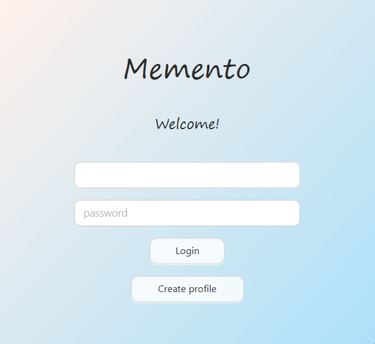
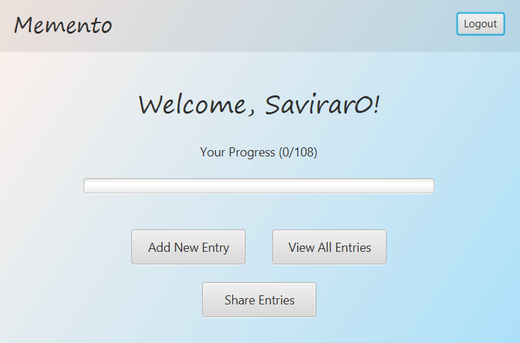
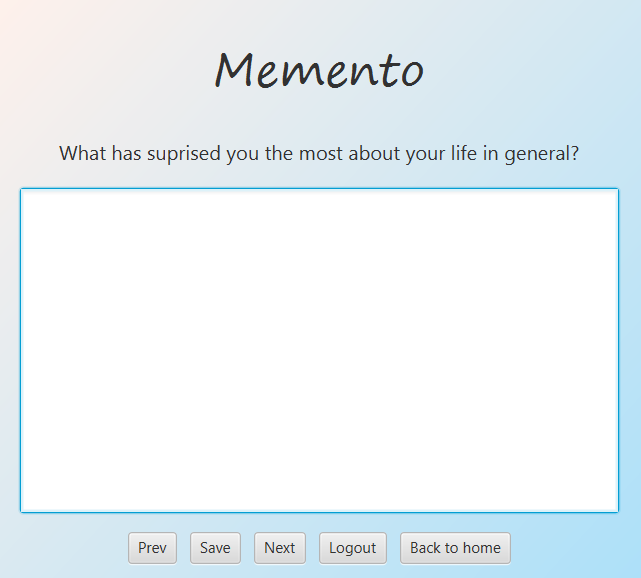

# Memento - A Life Journal Application to Share with Friends and Loved Ones


A JavaFX desktop application for journaling and self-reflection through 108 guided life questions.
User's answers can be shared with their friends and loved ones, so they can understand the user much better.
Answering these questions will also help the user in understanding themselves much better.

## Installation for windows
Download from release - [download](https://github.com/Savirar0/Memento/releases/tag/v1.0)

## Features

-  Answer 108 curated life questions
-  User authentication (signup/login)
-  SQLite database for data persistence
-  Progress tracking
-  View and edit past entries
-  Share your answers with your friends and loved ones so they can understand you better by exporting journal as PDF
-  Windows installer included

## Technologies Used

- **JavaFX 17** - UI Framework
- **SQLite** - Database
- **OpenPDF** - PDF generation
- **Inno Setup** - Windows installer

## Screenshots





## Project Structure
```
dairy/
├── src/
│   ├── App.java
│   ├── controllers/
│   ├── database/
│   ├── fxmlsViews/
│   └── CSS/
├── assets/
│   └── icon.ico
├── manifest.txt
└── installer.iss
```

## Building from Source

### Prerequisites
- JDK 17
- JavaFX SDK 17
- SQLite JDBC driver
- OpenPDF library

### Compile
```bash
javac --module-path javafx/lib --add-modules javafx.controls,javafx.fxml -d bin src/**/*.java
```

### Create JAR
```bash
jar --create --file Memento.jar --manifest manifest.txt -C bin .
```

### Create Installer
1. Install [Inno Setup](https://jrsoftware.org/isdl.php)
2. Open `installer.iss`
3. Build → Compile

## Running the Application

### From Source
```bash
java --module-path javafx/lib --add-modules javafx.controls,javafx.fxml -jar Memento.jar
```

### From Installer
Run `Memento_Setup.exe` and follow the installation wizard.

## Database

User data is stored in:
```
C:\Users\<username>\dairy\life108.db
```
life108, contains three tables only users, questions, and answers. And your data is staying in your device unless you're sharing it.

## Author


- [@Savirar0](https://github.com/Savirar0)

## Lessons Learned
I wanted to build something after watching JavaFX series of Bro Code on YouTube and this is what I've built. The inspiration was a book which I received as a Christmas gift, so there was a list of 108 questions regarding life. So I built an application out of it putting JavaFX to use.

From this project I've understood JavaFX much better, learned how to connect it with SQLite through JDBC, understood border pane and other panes in Scene Builder much better and learned how difficult it is to package a working application for Windows. I used ChatGPT for this part as I have an idea regarding packaging, but still I've faced many issues such as Java version mismatch, JavaFX runtime vs FXML version mismatch, QuantumRenderer / GPU pipeline crash, JAR file issues, and many more. Honestly, it took almost a day to navigate through all this, but it was interesting.

